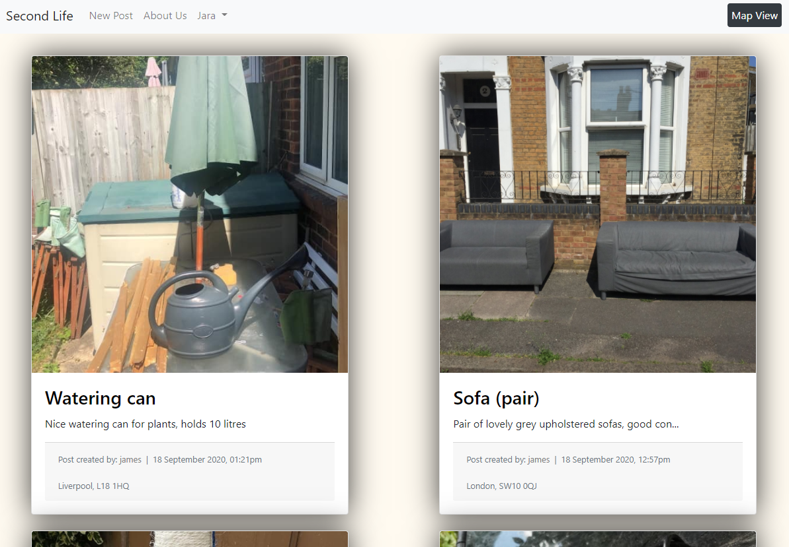

# SECOND LIFE

Our society moves at a dizzying pace. New technologies and the concept of fast fashion cause us to get rid of our belongings more and more often. Jeans from last season are no longer in fashion, and that lamp no longer matches your new cushion. And it is so easy to replace them... Unfortunately our planet does not have unlimited resources, our landfills are full and those objects that you do not want deserve a “Second Life”.

## App Demo in Heroku
https://second-life-app.herokuapp.com/



## How does it work?
An app based on Google Maps API where users can mark the exact location of any kind of goods left on the street for other people to collect. Posts can be made by the previous owner (the person leaving the goods outside) or by any other user that sees goods on the street (just need to take a picture and post it with the location).

As a user you will see a list of items and their locations, so you can easily go and rescue those objects you could give a Second Life. Every post will provide a list of objects left on the street, the location and a brief description. We would also have the possibility to change into map view, which will display and interactive map with a marker for every post, making it easier to search by area.

## Who are we?

- [**James Oddy**](https://github.com/jamesoddy8)
- [**Jara Santamaria Martinez**](https://github.com/jarasmar)
- [**George Swarbrick**](https://github.com/Swarbzz)


## FEATURES
>owner = user posting an item that can be collected

>client = user collecting an item that has been posted

### Two Main Views
- **Main View:** Grid of posted items (image, title, begining of description, location, links) - Change to Map View
- **Map View:** Map with pins (on click: image, title, beginning of description, location, links) - Change to List View

### Posts
- **Post Page:** picture, title, description, location, list of objects available, date and time, map.

### Users
- **Registration:** username, email, password, profile picture.
- **User Page:** profile information - my posted items - post new item

### Extra Features
- Availability: client can mark items in the checklist if collected (1 point for owner) - owner can mark items as gone in the checklist too.
- Display the last time a post was updated.
- 'Filter by' options (date, nearby, keyword)
- Tags: Furniture - Clothing - Kitchen - Garden - Sports/Games - Electronics - Family - Books/Music/Films - Pet Supplies - Reform Supplies - Other (default)
- Customised alerts for new posted items (tag, keywords, location...)
- Weather advice when posting ('It's going to rain, better to wait until Thursday!')
- Search bar for items by keywords
- Adapt the web app into a mobile app (automatic location, access to the device camera)
- Implement dark mode

## How to run the app

Clone or Download the repository
```
$ git clone git@github.com:jarasmar/Second_Life.git
```
Install all dependencies:
```
$ bundle install
```
Set up the databases:
```
$ rails db:create
$ rails db:migrate
```
Start the server:
```
$ rails start
```
Visit http://localhost:5000/

## Test Coverage

We have done our feature testing with Capybara and our app has a 99.49% test coverage.

## Heroku App
https://second-life-app.herokuapp.com/
